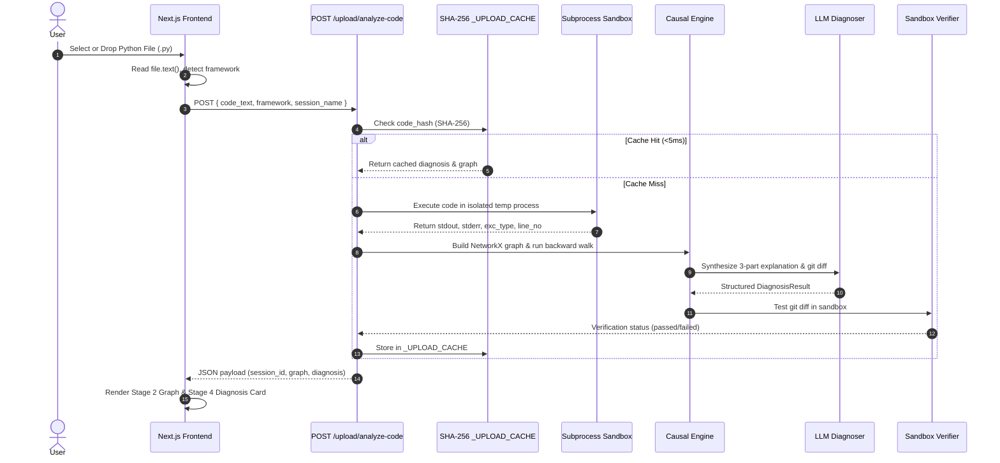

# Technical Requirements Document (TRD) — TraceMind / ICHNOUS

**Product Title:** TraceMind / ICHNOUS — Technical Architecture & Specifications  
**Document Version:** 1.0.0 (Production Release)  
**Status:** Approved Technical Single Source of Truth  
**Target Environment:** Linux / Docker / Node.js 20+ / Python 3.10+

---

## 1. System Overview & Technology Stack

TraceMind / ICHNOUS is architected as a decoupled, multi-layered full-stack system consisting of a high-performance **FastAPI Backend Engine** (Python 3.14) and a pixel-perfect **Next.js 16 Presentation Workspace** (React 19, TypeScript 5, Tailwind CSS, TanStack React Query, `@xyflow/react`).

```
+-----------------------------------------------------------------------+
|                      PRESENTATION LAYER (Next.js 16)                 |
|  - React Flow (@xyflow/react) DAG Canvas                             |
|  - Guided 6-Stage Workflow Stepper                                    |
|  - TanStack React Query (10-min staleTime diagnosis caching)          |
|  - Tailwind CSS + Space Grotesk / JetBrains Mono Design Tokens         |
+-----------------------------------------------------------------------+
                                   | REST / HTTP & WebSocket
                                   v
+-----------------------------------------------------------------------+
|                      APPLICATION ENGINE (FastAPI)                     |
|  - APIRouters: /traces, /sessions, /upload, /agent365                |
|  - SessionManager: In-memory session state & TTL garbage collection  |
|  - WebSocketHub: Asynchronous event broadcasting                      |
+-----------------------------------------------------------------------+
                                   |
         +-------------------------+-------------------------+
         |                                                   |
         v                                                   v
+-----------------------------------+   +------------------------------------+
|  CAUSAL INTELLIGENCE SUBSYSTEM    |   |  GNN REGRESSION INTELLIGENCE ENGINE|
|  - NetworkX DiGraph Builder       |   |  - Heterogeneous Graph Transformer |
|  - Anomaly Detector               |   |    (HGT Encoder - PyTorch)          |
|  - Critical Path Extractor        |   |  - FAISS-like Vector Memory Bank   |
|  - Backward Causal Walk Engine    |   |  - GNNExplainer Subgraph Masker    |
|  - LLM Diagnosis Synthesizer      |   |  - Closed-Loop Sandbox Verifier    |
+-----------------------------------+   +------------------------------------+
```

---

## 2. Component Specifications & Component Architecture

### 2.1 Backend Subsystems (`backend/`)

1. **FastAPI Application Entrypoint (`app.py`):**
   - Initializes FastAPI instance with CORS middleware, router registration, landing page `/`, and `/health` monitoring metrics.

2. **Session & Ingestion Management (`backend/session/`):**
   - `manager.py`: Manages session lifecycles (`CREATED` -> `RUNNING` -> `COMPLETING` -> `COMPLETED` / `FAILED`), session locks, event logs, and in-memory TTL garbage collection.
   - `websocket_hub.py`: Manages live WebSocket clients and broadcasts trace events line-by-line.
   - `converter.py`: Transforms raw `TraceSession` event streams into structured `Trace` objects.

3. **Causal Graph & Anomaly Subsystem (`backend/graph/`):**
   - `builder.py`: Constructs NetworkX `DiGraph` representation from execution trace steps.
   - `analyzer.py`: Runs statistical anomaly detection (`detect_anomalies`), critical path extraction (`extract_critical_path`), backward walk (`backward_walk`), and root cause divergence ranking.

4. **Diagnosis Subsystem (`backend/diagnosis/`):**
   - `llm.py`: Interfaces with NVIDIA NIM, OpenAI, Anthropic, or deterministic fallback routines (`_fallback_diagnosis`) to generate structured 3-part developer explanations.
   - `validator.py`: Groundedness validator guaranteeing evidence IDs exist in the execution graph.
   - `taxonomy.py`: Enforces fixed failure taxonomy (`Retrieval`, `Tool`, `Coordination`, `Memory`, `Prompt`, `Latency`, `None`).

5. **GNN & Regression Intelligence Engine (`backend/gnn/` & `backend/regression/`):**
   - `pytorch_model.py`: Implements `DummyHGTModel` PyTorch neural tensor network with global singleton caching.
   - `encoder.py`: Heterogeneous Graph Transformer node/edge feature encoder.
   - `memory_bank.py`: Cosine similarity vector memory bank retrieving historical execution motifs.
   - `explainer.py`: GNNExplainer calculating node & edge importance masks.
   - `verifier.py` (`agent365/engine/verifier.py`): Closed-loop sandbox executor testing git-diff patches against agent source code.

---

## 3. Data Flow & Request Lifecycles

### 3.1 Source Code Upload & Sandbox Execution Flow



---

## 4. Environment Configuration & Deployment Specifications

### 4.1 Environment Variables Matrix

| Variable | Scope | Description | Default / Example |
|---|---|---|---|
| `HOST` | Backend | Server binding host | `0.0.0.0` |
| `PORT` | Backend | Server binding port | `8000` |
| `CORS_ORIGINS` | Backend | Allowed CORS origins list | `["http://localhost:3000"]` |
| `ANTHROPIC_API_KEY` | Backend | Anthropic Claude API key for diagnosis | `sk-ant-...` (Optional) |
| `OPENAI_API_KEY` | Backend | OpenAI GPT-4o API key for diagnosis | `sk-...` (Optional) |
| `NVIDIA_API_KEY` | Backend | NVIDIA NIM API key for Llama 3.1 70B | `nvapi-...` (Optional) |
| `NEXT_PUBLIC_API_URL` | Frontend | Target FastAPI backend URL | `http://localhost:8000` |

### 4.2 Build & Execution Commands
- **Backend Dev Server:** `python3 -m uvicorn app:app --port 8000 --reload`
- **Backend Test Suite:** `python3 -m pytest`
- **Frontend Dev Server:** `npm run dev --webpack`
- **Frontend Production Build:** `npm run build --webpack`
