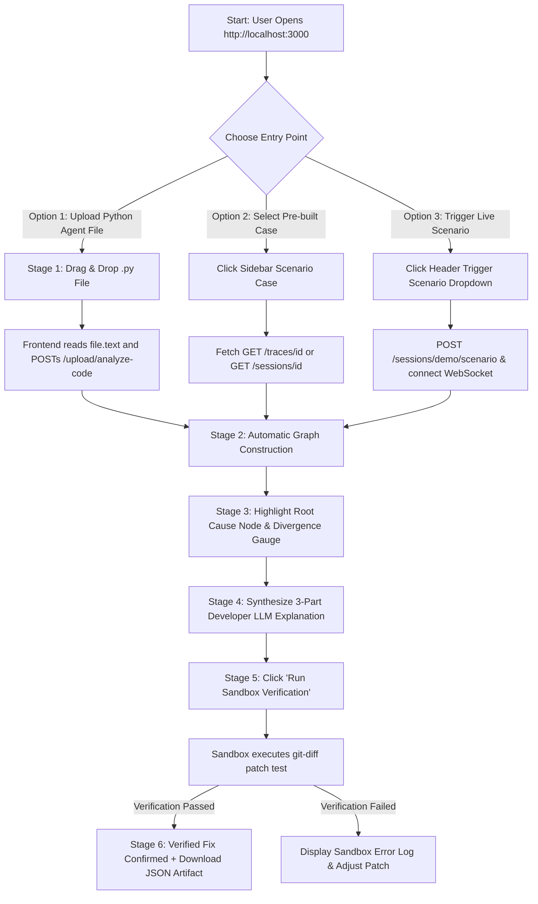

# User Flow & Application Flow Documentation — TraceMind / ICHNOUS

**Product Title:** TraceMind / ICHNOUS — Application Workflow & User Journey Blueprint  
**Document Version:** 1.0.0 (Production Release)  
**Status:** Approved Technical Single Source of Truth

---

## 1. End-to-End User Flow: Upload-to-Verified-Fix

---

## 2. Comprehensive Workflow Descriptions

### 2.1 File Upload Workflow (Stage 1 -> Stage 6)
1. **User Action:** User drags `failing_agent.py` into the Stage 1 dropzone or modal.
2. **Frontend Processing:** Reads the file text asynchronously, detects framework imports (`custom`), and posts `Content-Type: application/json` to `POST /upload/analyze-code`.
3. **Backend Processing:** Checks SHA-256 cache. On hit (<5ms), returns cached session. On miss, executes code in sandboxed process, parses exception, builds NetworkX graph, computes backward walk, calls LLM diagnoser, and runs patch verifier.
4. **UI State Transition:** Automatically advances stepper from `Stage 1: Upload & Ingest` -> `Stage 2: Graph Build` -> `Stage 3: Root Cause` -> `Stage 4: AI Diagnosis`.
5. **Verification & Completion:** User clicks `Run Sandbox Verification →`. Verification terminal streams execution status. Upon success, Stage 6 displays a green "VERIFIED FIX CONFIRMED" banner.

---

## 3. Navigation Hierarchy & Route Map

| Client Route | View Mode | Key Components | Trigger / Condition |
|---|---|---|---|
| `/` | Guided Workflow Mode | `WorkflowStepper`, `GuidedWorkflowView` | Default app landing |
| `/` (Toggle) | Full Dashboard Mode | `Header`, `CasesSidebar`, `GraphCanvas`, `InvestigationSummary`, `ExecutionTimeline` | Clicked "Full Dashboard Mode" toggle |
